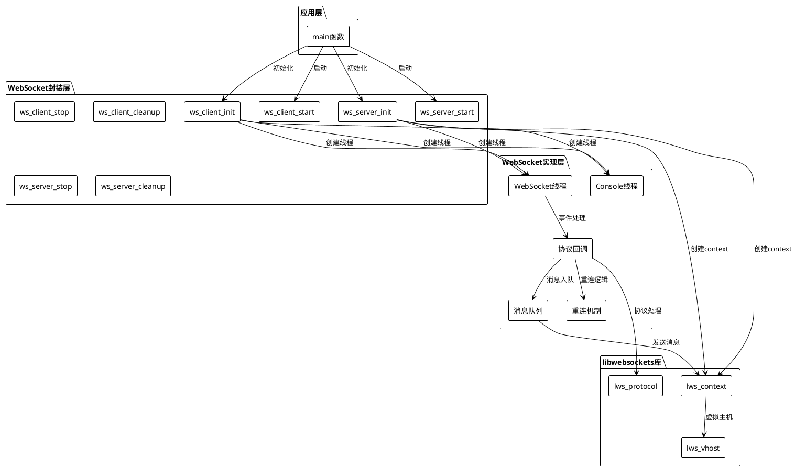
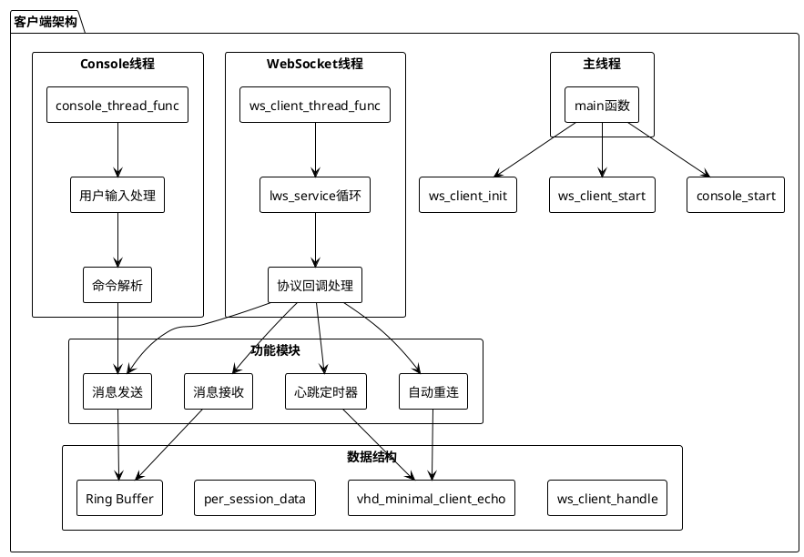
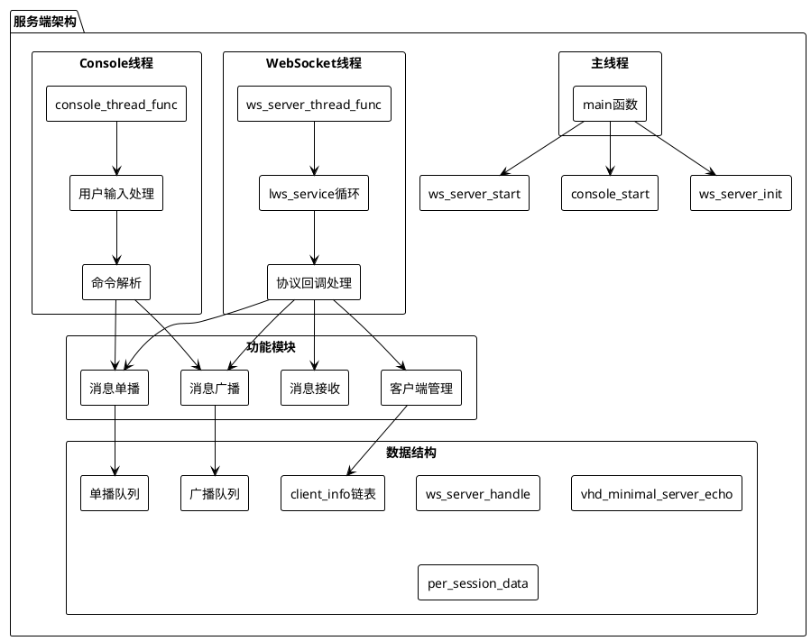
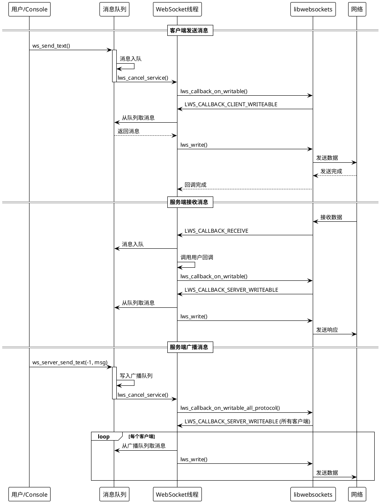
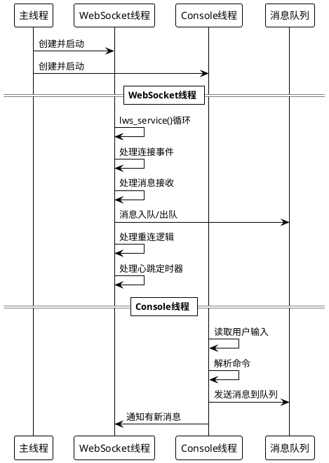
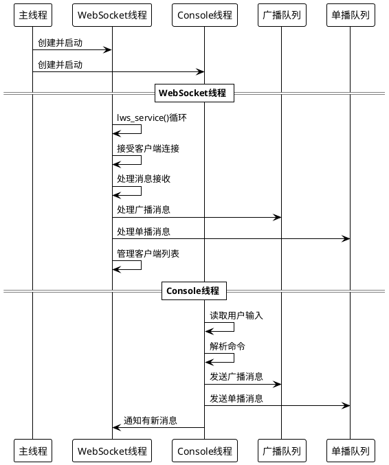
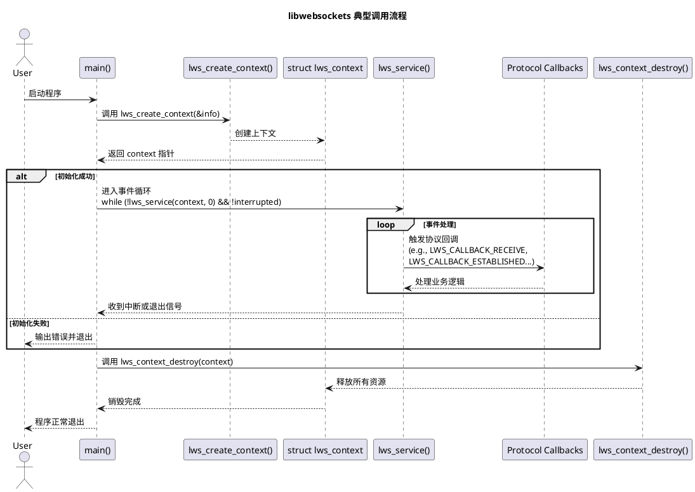

# WebSocket Echo Client/Server

基于 libwebsockets 的高性能 WebSocket 客户端和服务端实现，支持多线程、断线重连、消息队列、广播/单播等功能。

## 📋 目录

- [项目概述](#项目概述)
- [功能特性](#功能特性)
- [架构设计](#架构设计)
- [快速开始](#快速开始)
- [配置说明](#配置说明)
- [API 文档](#api-文档)
- [使用示例](#使用示例)
- [线程模型](#线程模型)
- [错误处理](#错误处理)
- [性能优化](#性能优化)
- [常见问题](#常见问题)

## 🎯 项目概述

本项目提供了一套完整的 WebSocket 客户端和服务端实现，采用模块化设计，支持：

- **客户端**：自动重连、心跳保活、消息队列、回调接口
- **服务端**：多客户端管理、广播/单播、客户端列表追踪、消息队列

### 核心优势

- ✅ **模块化设计**：清晰的接口边界，易于集成和扩展
- ✅ **线程安全**：多线程架构，支持并发操作
- ✅ **自动重连**：支持指数退避策略和最大重连次数限制
- ✅ **消息队列**：内置 Ring Buffer，支持流控
- ✅ **灵活配置**：支持命令行参数和运行时配置
- ✅ **完整回调**：接收、连接状态、发送完成回调

## ✨ 功能特性

### 客户端特性

- 🔄 **自动重连机制**
  - 可配置重连间隔
  - 指数退避策略
  - 最大重连次数限制
  - 连接失败自动重试

- 💓 **心跳保活**
  - 可配置心跳周期
  - 自动发送心跳消息
  - 保持连接活跃

- 📦 **消息队列**
  - Ring Buffer 实现
  - 线程安全的消息队列
  - 支持流控（Flow Control）

- 🎯 **回调接口**
  - 接收数据回调
  - 连接状态回调
  - 发送完成回调

### 服务端特性

- 👥 **多客户端管理**
  - 客户端连接列表
  - 客户端信息追踪（IP、端口、连接时间）
  - 唯一客户端ID分配

- 📢 **消息广播**
  - 向所有客户端广播消息
  - 循环缓冲区存储历史消息
  - 新连接自动接收最新消息

- 📨 **单播消息**
  - 向指定客户端发送消息
  - 每个客户端独立消息队列
  - 线程安全的队列操作

- 🖥️ **控制台交互**
  - 实时查看客户端列表
  - 发送广播/单播消息
  - 服务器状态查询

## 🏗️ 架构设计

### 系统架构图



### 客户端架构



### 服务端架构



### 消息流程图



## 🚀 快速开始

### 编译

```bash
# 编译客户端
gcc -o minimal-ws-client-echo-console minimal-ws-client-echo-console.c \
    -lwebsockets -lpthread -lssl -lcrypto

# 编译服务端
gcc -o minimal-ws-server-echo-console minimal-ws-server-echo-console.c \
    -lwebsockets -lpthread -lssl -lcrypto
```

### 运行服务端

```bash
# 默认配置（端口54321）
./minimal-ws-server-echo-console

# 指定端口
./minimal-ws-server-echo-console -p 8080

# 指定协议名称
./minimal-ws-server-echo-console --protocol "my-protocol" -p 8080

# 查看帮助
./minimal-ws-server-echo-console --help
```

### 运行客户端

```bash
# 连接到默认服务器（localhost:54321）
./minimal-ws-client-echo-console

# 指定服务器地址和端口
./minimal-ws-client-echo-console -s 192.168.1.100 -p 8080

# 指定协议名称
./minimal-ws-client-echo-console --protocol "my-protocol" -s localhost -p 8080

# 指定URL路径
./minimal-ws-client-echo-console -u /ws/echo

# 启用SSL
./minimal-ws-client-echo-console --ssl -s wss.example.com -p 443
```

### 基本使用

1. **启动服务端**
   ```bash
   $ ./minimal-ws-server-echo-console -p 8080
   Server listening on port 8080
   Server console ready. Commands:
     clients       - Show connected clients list
     send <id> <msg> - Send message to specific client
     status        - Show server status
     help          - Show help information
     quit          - Exit server
     other         - Broadcast to all clients
   srv> 
   ```

2. **启动客户端**
   ```bash
   $ ./minimal-ws-client-echo-console -s localhost -p 8080
   Connecting to localhost:8080/
   === Connection established ===
   ws> 
   ```

3. **发送消息**
   - 客户端：直接在控制台输入消息，按回车发送
   - 服务端：输入消息广播给所有客户端，或使用 `send <id> <msg>` 发送给指定客户端

## ⚙️ 配置说明

### 客户端配置

#### 命令行参数

| 参数 | 说明 | 默认值 | 示例 |
|------|------|--------|------|
| `-s` | 服务器地址 | `localhost` | `-s 192.168.1.100` |
| `-p` | 服务器端口 | `54321` | `-p 8080` |
| `-u` | URL路径 | `/` | `-u /ws/echo` |
| `-i` | 网络接口 | `NULL` | `-i eth0` |
| `--protocol` | 协议名称 | `fws_a-burning` | `--protocol my-protocol` |
| `--ssl` | 启用SSL | 否 | `--ssl` |
| `-o` | 单次模式 | 否 | `-o` |
| `-d` | 日志级别 | `7` | `-d 31` |

#### 编译时配置

```c
// WebSocket 客户端保活策略
#define WS_CLIENT_HEARTBEAT_TICK_MS   (5*1000)  // 心跳检测周期
#define WS_CLIENT_PING_INTERVAL_SEC   30        // 无业务流量多久后发送 Ping
#define WS_CLIENT_PONG_TIMEOUT_SEC    10        // 等待 Pong 的超时时间
#define WS_CLIENT_IDLE_TIMEOUT_SEC    120       // 判定无效链路的超时时间

// 重连间隔时间（毫秒）
#define RECONNECT_INTERVAL_MS (3*1000)  // 默认3秒

// 最大重连次数（0表示无限重连）
#define RECONNECT_MAX_RETRIES 0

// 是否启用退避策略
#define RECONNECT_BACKOFF_ENABLE 1

// 退避最大间隔（毫秒）
#define RECONNECT_BACKOFF_MAX (30*1000)  // 30秒

// Ring Buffer深度
#define RING_DEPTH 1024

// 数据日志开关
#define LWS_MIN_CLIENT_ECHO_DATA_LOG 1

// 控制台提示符
#define LWS_MIN_CLIENT_PROMPT "ws> "
```

### 服务端配置

#### 命令行参数

| 参数 | 说明 | 默认值 | 示例 |
|------|------|--------|------|
| `-p` | 监听端口 | `54321` | `-p 8080` |
| `--protocol` | 协议名称 | `fws_a-burning` | `--protocol my-protocol` |
| `-o` | 单次模式 | 否 | `-o` |
| `-d` | 日志级别 | `7` | `-d 31` |

#### 编译时配置

```c
// Ring Buffer深度
#define RING_DEPTH 4096

// 广播队列容量
#define BROADCAST_QUEUE_CAP 64

// 单播队列容量（每个客户端）
#define UNICAST_QUEUE_CAP 32

// 数据日志开关
#define LWS_MIN_SERVER_ECHO_DATA_LOG 1

// 控制台提示符
#define LWS_MIN_SERVER_PROMPT "srv> "
```

## 📚 API 文档

### 客户端 API

#### ws_client_init()

初始化 WebSocket 客户端。

```c
struct ws_client_handle* ws_client_init(
    struct ws_client_config *config,
    int *interrupted_flag
);
```

**参数：**
- `config`: 客户端配置结构指针
- `interrupted_flag`: 中断标志指针

**返回值：**
- 成功：客户端句柄指针
- 失败：`NULL`

**配置结构：**
```c
struct ws_client_config {
    const char *server_addr;       // 服务器地址
    int port;                      // 服务器端口
    const char *url_path;          // URL路径
    const char *iface;             // 网络接口（可选）
    const char *protocol;          // 协议名称
    int options;                   // 选项标志
    struct ws_callbacks callbacks;  // 回调函数
};
```

#### ws_send_text()

发送文本消息到服务器。

```c
int ws_send_text(
    struct vhd_minimal_client_echo *vhd,
    const char *data,
    size_t len
);
```

**参数：**
- `vhd`: WebSocket 虚拟主机数据指针
- `data`: 要发送的文本数据
- `len`: 数据长度（0表示自动计算）

**返回值：**
- `WS_OK (0)`: 成功
- `WS_ERR_INVALID_PARAM (-1)`: 无效参数
- `WS_ERR_NOT_CONNECTED (-2)`: 未连接
- `WS_ERR_NOT_READY (-3)`: Ring未就绪
- `WS_ERR_NO_MEMORY (-4)`: 内存分配失败
- `WS_ERR_QUEUE_FULL (-5)`: 发送队列已满

#### ws_is_connected()

检查 WebSocket 是否已连接。

```c
int ws_is_connected(struct vhd_minimal_client_echo *vhd);
```

**返回值：**
- `1`: 已连接
- `0`: 未连接

### 服务端 API

#### ws_server_init()

初始化 WebSocket 服务端。

```c
struct ws_server_handle* ws_server_init(
    struct ws_server_config *config,
    int *interrupted_flag
);
```

**参数：**
- `config`: 服务端配置结构指针
- `interrupted_flag`: 中断标志指针

**返回值：**
- 成功：服务端句柄指针
- 失败：`NULL`

**配置结构：**
```c
struct ws_server_config {
    int port;                      // 监听端口
    const char *protocol;          // 协议名称
    int options;                   // 选项标志
};
```

#### ws_server_send_text()

向指定客户端或所有客户端发送消息。

```c
int ws_server_send_text(
    struct vhd_minimal_server_echo *vhd,
    int client_id,
    const char *data,
    size_t len
);
```

**参数：**
- `vhd`: WebSocket 虚拟主机数据指针
- `client_id`: 客户端ID（-1表示广播到所有客户端）
- `data`: 要发送的数据
- `len`: 数据长度（0表示自动计算）

**返回值：**
- `0`: 成功
- `-1`: 失败
- `-2`: 客户端未找到

### 回调接口

```c
struct ws_callbacks {
    ws_on_receive_cb on_receive;   // 接收数据回调（必须）
    ws_on_connect_cb on_connect;   // 连接状态回调（可选）
    ws_on_sent_cb on_sent;         // 发送完成回调（可选）
    void *user_data;               // 用户自定义数据
};

// 接收数据回调
typedef void (*ws_on_receive_cb)(
    const void *data,
    size_t len,
    int is_binary,
    void *user_data
);

// 连接状态回调
typedef void (*ws_on_connect_cb)(
    int connected,  // 1=连接，0=断开
    void *user_data
);

// 发送完成回调
typedef void (*ws_on_sent_cb)(
    const void *data,
    size_t len,
    void *user_data
);
```

## 💡 使用示例

### 客户端示例

#### 基本使用

```c
#include <signal.h>
#include <stdio.h>

static int interrupted = 0;

void sigint_handler(int sig) {
    interrupted = 1;
}

// 接收数据回调
void on_receive(const void *data, size_t len, int is_binary, void *user_data) {
    printf("Received: %.*s\n", (int)len, (char*)data);
}

// 连接状态回调
void on_connect(int connected, void *user_data) {
    if (connected) {
        printf("Connected!\n");
    } else {
        printf("Disconnected!\n");
    }
}

int main(int argc, const char **argv) {
    signal(SIGINT, sigint_handler);
    
    struct ws_client_config config = {
        .server_addr = "localhost",
        .port = 54321,
        .url_path = "/",
        .protocol = "fws_a-burning",
        .options = 0,
        .callbacks = {
            .on_receive = on_receive,
            .on_connect = on_connect,
            .on_sent = NULL,
            .user_data = NULL
        }
    };
    
    struct ws_client_handle *handle = ws_client_init(&config, &interrupted);
    if (!handle) {
        return 1;
    }
    
    ws_client_start(handle);
    
    while (!interrupted) {
        sleep(1);
    }
    
    ws_client_stop(handle);
    ws_client_cleanup(handle);
    
    return 0;
}
```

#### 发送消息

```c
// 获取vhd指针（通常在回调中获取）
struct vhd_minimal_client_echo *vhd = ...;

// 发送文本消息
int ret = ws_send_text(vhd, "Hello, Server!", 0);
if (ret != WS_OK) {
    printf("Send failed: %s\n", ws_get_error_string(ret));
}
```

### 服务端示例

#### 基本使用

```c
#include <signal.h>

static int interrupted = 0;

void sigint_handler(int sig) {
    interrupted = 1;
}

int main(int argc, const char **argv) {
    signal(SIGINT, sigint_handler);
    
    struct ws_server_config config = {
        .port = 54321,
        .protocol = "fws_a-burning",
        .options = 0
    };
    
    struct ws_server_handle *handle = ws_server_init(&config, &interrupted);
    if (!handle) {
        return 1;
    }
    
    ws_server_start(handle);
    
    while (!interrupted) {
        sleep(1);
    }
    
    ws_server_stop(handle);
    ws_server_cleanup(handle);
    
    return 0;
}
```

#### 广播消息

```c
// 获取vhd指针
struct vhd_minimal_server_echo *vhd = ...;

// 广播消息给所有客户端
int ret = ws_server_send_text(vhd, -1, "Broadcast message", 0);
if (ret != 0) {
    printf("Broadcast failed\n");
}
```

#### 单播消息

```c
// 向客户端ID为1的客户端发送消息
int ret = ws_server_send_text(vhd, 1, "Hello, Client 1!", 0);
if (ret == -2) {
    printf("Client not found\n");
} else if (ret != 0) {
    printf("Send failed\n");
}
```

## 🧵 线程模型

### 客户端线程模型



### 服务端线程模型


### 客户端库设计



### 线程安全

- ✅ 所有共享数据结构都使用互斥锁保护
- ✅ Ring Buffer 操作在锁保护下进行
- ✅ 客户端列表操作使用互斥锁
- ✅ 消息队列操作使用互斥锁

## ⚠️ 错误处理

### 错误码定义

#### 客户端错误码

| 错误码 | 宏定义 | 说明 |
|--------|--------|------|
| `0` | `WS_OK` | 成功 |
| `-1` | `WS_ERR_INVALID_PARAM` | 无效参数 |
| `-2` | `WS_ERR_NOT_CONNECTED` | WebSocket未连接 |
| `-3` | `WS_ERR_NOT_READY` | Ring未就绪 |
| `-4` | `WS_ERR_NO_MEMORY` | 内存分配失败 |
| `-5` | `WS_ERR_QUEUE_FULL` | 发送队列已满 |
| `-6` | `WS_ERR_CONNECTING` | 正在连接中 |

#### 服务端错误码

| 返回值 | 说明 |
|--------|------|
| `0` | 成功 |
| `-1` | 失败（队列满、内存不足等） |
| `-2` | 客户端未找到 |

### 错误处理示例

```c
// 客户端发送消息错误处理
int ret = ws_send_text(vhd, "Hello", 0);
if (ret != WS_OK) {
    switch (ret) {
        case WS_ERR_NOT_CONNECTED:
            printf("Not connected, message cached\n");
            // 可以缓存消息，连接后重试
            break;
        case WS_ERR_QUEUE_FULL:
            printf("Queue full, dropping message\n");
            break;
        default:
            printf("Send failed: %s\n", ws_get_error_string(ret));
            break;
    }
}

// 服务端发送消息错误处理
int ret = ws_server_send_text(vhd, client_id, "Hello", 0);
if (ret == -2) {
    printf("Client %d not found\n", client_id);
} else if (ret != 0) {
    printf("Send failed\n");
}
```

## 🚀 性能优化

### 客户端优化

1. **Ring Buffer**
   - 使用固定大小的 Ring Buffer，避免频繁内存分配
   - 深度可配置（默认1024）

2. **流控（Flow Control）**
   - 当队列快满时暂停接收
   - 当队列有空间时恢复接收

3. **心跳优化**
   - 可配置心跳周期
   - 避免连接超时

### 服务端优化

1. **客户端列表管理**
   - 使用链表存储客户端信息
   - O(1) 时间复杂度的添加操作
   - 线程安全的操作

2. **广播队列**
   - 循环缓冲区存储历史消息
   - 新连接自动接收最新消息
   - 避免重复发送

3. **单播队列**
   - 每个客户端独立的队列
   - 避免消息阻塞
   - 线程安全的操作

### 性能指标

- **消息吞吐量**：取决于网络带宽和CPU性能
- **并发连接数**：理论上无限制，实际受系统资源限制
- **内存占用**：每个连接约几KB（取决于队列大小）
- **CPU占用**：低，事件驱动模型

## ❓ 常见问题

### Q1: 如何修改心跳周期？

**A:** 修改以下保活相关宏即可：
```c
#define WS_CLIENT_HEARTBEAT_TICK_MS   (5*1000)
#define WS_CLIENT_PING_INTERVAL_SEC   45
#define WS_CLIENT_PONG_TIMEOUT_SEC    15
#define WS_CLIENT_IDLE_TIMEOUT_SEC    180
```

### Q2: 如何禁用自动重连？

**A:** 设置最大重连次数为0（实际上0表示无限重连），可以设置为1：
```c
#define RECONNECT_MAX_RETRIES 1
```

### Q3: 如何增加消息队列大小？

**A:** 修改 Ring Buffer 深度：
```c
// 客户端
#define RING_DEPTH 2048  // 增加到2048

// 服务端
#define RING_DEPTH 8192  // 增加到8192
```

### Q4: 如何处理二进制消息？

**A:** 回调函数中 `is_binary` 参数标识消息类型：
```c
void on_receive(const void *data, size_t len, int is_binary, void *user_data) {
    if (is_binary) {
        // 处理二进制消息
    } else {
        // 处理文本消息
    }
}
```

### Q5: 如何获取客户端IP地址？

**A:** 服务端可以通过客户端信息结构获取：
```c
struct client_info *client = ...;
printf("Client IP: %s\n", client->ip);
printf("Client Port: %d\n", client->port);
```

### Q6: 如何自定义协议名称？

**A:** 使用命令行参数：
```bash
# 客户端
./minimal-ws-client-echo-console --protocol "my-protocol"

# 服务端
./minimal-ws-server-echo-console --protocol "my-protocol"
```

### Q7: 如何启用SSL/TLS？

**A:** 客户端使用 `--ssl` 参数：
```bash
./minimal-ws-client-echo-console --ssl -s wss.example.com -p 443
```

### Q8: 如何查看详细的调试信息？

**A:** 使用 `-d` 参数设置日志级别：
```bash
# 显示所有日志
./minimal-ws-client-echo-console -d 31

# 日志级别说明：
# LLL_ERR (1)   - 错误
# LLL_WARN (2)  - 警告
# LLL_NOTICE (4) - 通知
# LLL_INFO (8)  - 信息
# LLL_DEBUG (16) - 调试
```

## 📝 许可证

本项目基于 libwebsockets 库，遵循相应的许可证。

## 🤝 贡献

欢迎提交 Issue 和 Pull Request！

## 📧 联系方式

如有问题或建议，请通过 Issue 联系。

---

服务端：minimal-ws-server-echo-console.c
客户端：ws-echo-client-native.c
问题： 

**最后更新**: 2024年

